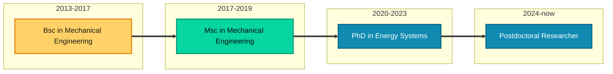

<strong>Energy Systems Researcher \| Optimization modeler \| Data Scientist</strong>

Bio
======
Lingkang is a Postdoctoral Researcher at the Department of Electrical Engineering, Eindhoven University of Technology, The Netherlands. He received the B.Sc. and M.Sc. degrees in Mechanical Engineering, as well as the Ph.D. degree in Energy Systems from Università Politecnica delle Marche, Italy, in 2017, 2019, and 2024, respectively. Since 2024, he has been a Postdoctoral Researcher in the Department of Electrical Engineering at Eindhoven University of Technology, The Netherlands. His research interests include energy storage integration and control, multi-energy systems, power-to-hydrogen conversion, power system operations, physics-informed modeling, machine learning, and optimization.

Education
======
* Ph.D in Energy Systems,  [Università Politecnica delle Marche](https://www.univpm.it/Entra/), 2024
* M.S. in Mechanical engineering with thermo-mechanical specialization, [Università Politecnica delle Marche](https://www.univpm.it/Entra/), 2019
* B.S. in Mechanical engineering, [Università Politecnica delle Marche](https://www.univpm.it/Entra/) , 2017

Work experience
======
* Jan 2024-Now: Postdoctoral Researcher
  * Technical University of Eindhoven
  * Duties includes: Scientific research on grid congestion management, supervision of Msc students, writing research proposals and project management.
  * Supervisor: Nikolaos Paterakis (n.paterakis@tue.nl) and Phuong Nguyen (p.nguyen.hong@tue.nl)

* Nov 2020-Oct 2023: Ph.D Researcher
  * Università Politecnica delle Marche
  * Duties included: Free research Ph.D. candidate on energy system modelling, optimization and control. thesis work on impact of the different types of energy storage systems on power system operation and planning.
  * Supervisor: Gabriele Comodi (g.comodi@staff.univpm.it)

* Dec 2019-Oct 2020: Engineering consultant
  * Capgemini Engineering
  * Duties included: Consultant for Whirlpool EMEA as lab engineering, supporting the testing activities for new appliances development and certification.
  * Supervisor: Piotr Rosiak

  
Skills
======
* Optimization models and algorithms application in energy systems (planning and scheduling)
  * Linear programming
  * Mixed-integer linear programming
  * Mixed- Integer Conic programming
  * Bilevel Optimization
* Multi-physics system level energy storage modeling and simulation 
  * Power-to-hydrogen systems
  * Lithium-ion batteries electrochemical modeling and degradation analysis
  * Alkaline electrolyser modeling
* Power systems analysis and operation
  * Power flow and optimal power flow for transmission and distribution systems
  * Grid congestion management techniques (technical and market-based)
  * Asset management and control of distributed energy resources
* Data analysis and programming
  * Python (Pandas, Numpy, Matplotlib, SciPy, Geopandas, Pyomo, plotly, seaborn, etc.)
  * Gurobi, CPLEX, MOSEK
  * LaTeX
* Software development and versioning control
  * Git and GitHub
  * Jupyter Notebooks
  * Docker
  * Markdown and HTML

Publications
======
  <ul>
    
  </ul>
  
Talks
======
  <ul>
    
  </ul>
  
Teaching
======
  <ul>
    
  </ul>
  
Service and leadership
======
* Currently signed in to 43 different slack teams

Getting started
======
1. Register a GitHub account if you don't have one and confirm your e-mail (required!)
1. Fork [this template](https://github.com/academicpages/academicpages.github.io) by clicking the "Use this template" button in the top right. 
1. Go to the repository's settings (rightmost item in the tabs that start with "Code", should be below "Unwatch"). Rename the repository "[your GitHub username].github.io", which will also be your website's URL.
1. Set site-wide configuration and create content & metadata (see below -- also see [this set of diffs](https://archive.is/3TPas) showing what files were changed to set up [an example site](https://getorg-testacct.github.io) for a user with the username "getorg-testacct")
1. Upload any files (like PDFs, .zip files, etc.) to the files/ directory. They will appear at https://[your GitHub username].github.io/files/example.pdf.  
1. Check status by going to the repository settings, in the "GitHub pages" section

Site-wide configuration
------
The main configuration file for the site is in the base directory in [_config.yml](https://github.com/academicpages/academicpages.github.io/blob/master/_config.yml), which defines the content in the sidebars and other site-wide features. You will need to replace the default variables with ones about yourself and your site's github repository. The configuration file for the top menu is in [_data/navigation.yml](https://github.com/academicpages/academicpages.github.io/blob/master/_data/navigation.yml). For example, if you don't have a portfolio or blog posts, you can remove those items from that navigation.yml file to remove them from the header. 

Create content & metadata
------
For site content, there is one Markdown file for each type of content, which are stored in directories like _publications, _talks, _posts, _teaching, or _pages. For example, each talk is a Markdown file in the [_talks directory](https://github.com/academicpages/academicpages.github.io/tree/master/_talks). At the top of each Markdown file is structured data in YAML about the talk, which the theme will parse to do lots of cool stuff. The same structured data about a talk is used to generate the list of talks on the [Talks page](https://academicpages.github.io/talks), each [individual page](https://academicpages.github.io/talks/2012-03-01-talk-1) for specific talks, the talks section for the [CV page](https://academicpages.github.io/cv), and the [map of places you've given a talk](https://academicpages.github.io/talkmap.html) (if you run this [python file](https://github.com/academicpages/academicpages.github.io/blob/master/talkmap.py) or [Jupyter notebook](https://github.com/academicpages/academicpages.github.io/blob/master/talkmap.ipynb), which creates the HTML for the map based on the contents of the _talks directory).

**Markdown generator**

The repository includes [a set of Jupyter notebooks](https://github.com/academicpages/academicpages.github.io/tree/master/markdown_generator
) that converts a CSV containing structured data about talks or presentations into individual Markdown files that will be properly formatted for the Academic Pages template. The sample CSVs in that directory are the ones I used to create my own personal website at stuartgeiger.com. My usual workflow is that I keep a spreadsheet of my publications and talks, then run the code in these notebooks to generate the Markdown files, then commit and push them to the GitHub repository.

How to edit your site's GitHub repository
------
Many people use a git client to create files on their local computer and then push them to GitHub's servers. If you are not familiar with git, you can directly edit these configuration and Markdown files directly in the github.com interface. Navigate to a file (like [this one](https://github.com/academicpages/academicpages.github.io/blob/master/_talks/2012-03-01-talk-1.md) and click the pencil icon in the top right of the content preview (to the right of the "Raw | Blame | History" buttons). You can delete a file by clicking the trashcan icon to the right of the pencil icon. You can also create new files or upload files by navigating to a directory and clicking the "Create new file" or "Upload files" buttons. 

Example: editing a Markdown file for a talk

For more info
------
More info about configuring Academic Pages can be found in [the guide](https://academicpages.github.io/markdown/), the [growing wiki](https://github.com/academicpages/academicpages.github.io/wiki), and you can always [ask a question on GitHub](https://github.com/academicpages/academicpages.github.io/discussions). The [guides for the Minimal Mistakes theme](https://mmistakes.github.io/minimal-mistakes/docs/configuration/) (which this theme was forked from) might also be helpful.
