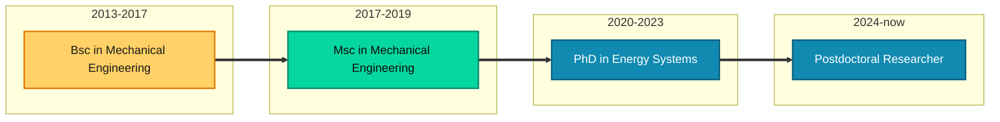

<strong>Energy Systems Researcher \| Optimization modeler \| Data Scientist</strong>

Bio
======
Lingkang is a Postdoctoral Researcher at the Department of Electrical Engineering, Eindhoven University of Technology, The Netherlands. He received the B.Sc. and M.Sc. degrees in Mechanical Engineering, as well as the Ph.D. degree in Energy Systems from Università Politecnica delle Marche, Italy, in 2017, 2019, and 2024, respectively. Since 2024, he has been a Postdoctoral Researcher in the Department of Electrical Engineering at Eindhoven University of Technology, The Netherlands. His research interests include energy storage integration and control, multi-energy systems, power-to-hydrogen conversion, power system operations, physics-informed modeling, machine learning, and optimization.

Education
======
* Ph.D in Energy Systems,  [Università Politecnica delle Marche](https://www.univpm.it/Entra/), 2024
* M.S. in Mechanical engineering with thermo-mechanical specialization, [Università Politecnica delle Marche](https://www.univpm.it/Entra/), 2019
* B.S. in Mechanical engineering, [Università Politecnica delle Marche](https://www.univpm.it/Entra/) , 2017

Work experience
======
* Jan 2024-Now: Postdoctoral Researcher
  * Technical University of Eindhoven
  * Duties includes: Scientific research on grid congestion management, supervision of Msc students, writing research proposals and project management.
  * Supervisor: Nikolaos Paterakis (n.paterakis@tue.nl) and Phuong Nguyen (p.nguyen.hong@tue.nl)

* Nov 2020-Oct 2023: Ph.D Researcher
  * Università Politecnica delle Marche
  * Duties included: Free research Ph.D. candidate on energy system modelling, optimization and control. thesis work on impact of the different types of energy storage systems on power system operation and planning.
  * Supervisor: Gabriele Comodi (g.comodi@staff.univpm.it)

* Dec 2019-Oct 2020: Engineering consultant
  * Capgemini Engineering
  * Duties included: Consultant for Whirlpool EMEA as lab engineering, supporting the testing activities for new appliances development and certification.
  * Supervisor: Piotr Rosiak

  
Skills
======
* Optimization models and algorithms application in energy systems (planning and scheduling)
  * Linear programming
  * Mixed-integer linear programming
  * Mixed- Integer Conic programming
  * Bilevel Optimization
* Multi-physics system level energy storage modeling and simulation 
  * Power-to-hydrogen systems
  * Lithium-ion batteries electrochemical modeling and degradation analysis
  * Alkaline electrolyser modeling
* Power systems analysis and operation
  * Power flow and optimal power flow for transmission and distribution systems
  * Grid congestion management techniques (technical and market-based)
  * Asset management and control of distributed energy resources
* Data analysis and programming
  * Python (Pandas, Numpy, Matplotlib, SciPy, Geopandas, Pyomo, plotly, seaborn, etc.)
  * Gurobi, CPLEX, MOSEK
  * LaTeX
* Software development and versioning control
  * Git and GitHub
  * Jupyter Notebooks
  * Docker
  * Markdown and HTML

Publications
======
  <ul>
    
  </ul>
  
Talks
======
  <ul>
    
  </ul>
  
Teaching
======
  <ul>
    
  </ul>
  
Service and leadership
======
* Currently involved in ORKEST project as R4 leader 
* Support in daily revision of Ph.D. students 

